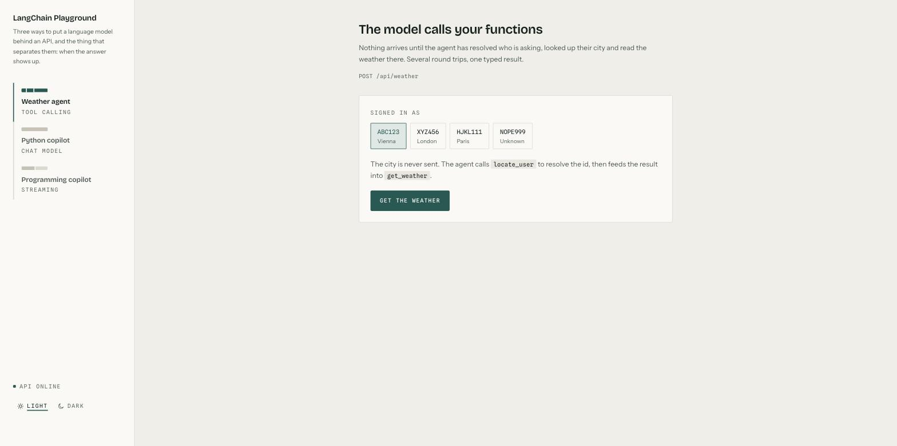

# LangChain Playground

[](https://github.com/olaheavy-dev/langchain-playground/actions/workflows/ci.yml)

A full-stack reference implementation of three distinct LLM integration patterns, built to
make the differences between them visible and comparable side by side.

**Stack:** FastAPI · LangChain · LangGraph · Python 3.13 · Next.js 16 · React 19 ·
TypeScript · Tailwind CSS v4 · pytest · Vitest



| Pattern | Module | What it demonstrates |
| --- | --- | --- |
| Tool-calling agent | `app/agents/weather.py` | The model decides when to call your own functions, and fills a typed response |
| Chat model | `app/agents/python_copilot.py` | One request, one complete answer |
| Streaming chat model | `app/agents/streaming_copilot.py` | The same answer, sent token by token as it is produced |

---

## The three patterns

### 1. Tool-calling agent

The caller sends only a user id. The agent calls `locate_user` to resolve that id to a
city, then feeds the result into `get_weather`, which hits a live weather API. The model
decides both calls and their order; nothing in the request names a city.

Output is a **typed structure**, not prose — the same Pydantic model serves as the HTTP
response schema and the agent's `response_format`.


### 2. Chat model

No tools, no agent loop. A seeded system/human/AI exchange steers tone and depth, then one
`ainvoke` returns the complete answer.


### 3. Streaming chat model

The same model driven by `astream`. Tokens are pushed to the browser over server-sent
events and rendered as they arrive; the request can be cancelled mid-flight.


### Handling the failure case honestly

An unrecognised user id resolves to `Unknown`. Rather than let the model invent a
plausible `0.0`, the schema makes every reading nullable, so a failed lookup returns
`null` and the interface has to show it. That constraint propagates through the generated
TypeScript types, forcing the frontend to handle it too.


---

## Getting started

Requires Python 3.13+, [uv](https://docs.astral.sh/uv/), and Node 20+.

**Backend** — in one terminal:

```bash
cd backend
cp .env.example .env        # then add your OpenAI key
uv sync
uv run uvicorn app.main:app --reload
```

The API is then on <http://127.0.0.1:8000>, with interactive docs at
<http://127.0.0.1:8000/docs>.

**Frontend** — in another:

```bash
cd frontend
cp .env.example .env.local  # defaults to the backend above
npm install
npm run dev
```

The interface is then on <http://localhost:3000>. It needs the backend running;
the sidebar shows a live indicator either way.

## Endpoints

### `POST /api/weather`

Reports the weather where the user is. The city is never sent by the caller — the agent
calls `locate_user` to resolve `user_id` to a city, then feeds that into `get_weather`.

```bash
curl -X POST http://127.0.0.1:8000/api/weather \
  -H 'Content-Type: application/json' \
  -d '{"user_id": "ABC123", "thread_id": "t1"}'
```

```json
{
  "summary": "In Vienna, it's currently 27°C (80°F) with patchy rain nearby. Humidity is at 45%...",
  "temperature_celsius": 27.0,
  "temperature_fahrenheit": 80.0,
  "humidity": 45.0,
  "trace": [
    { "label": "locate_user", "ms": 0.003 },
    { "label": "get_weather", "ms": 180.4 },
    { "label": "model", "ms": 3781.2 }
  ]
}
```

Known users are `ABC123` (Vienna), `XYZ456` (London) and `HJKL111` (Paris). Any other id
resolves to `Unknown`, and the agent says so rather than guessing — the three numeric
fields come back `null`, so callers must handle the case instead of reading a fabricated
`0.0`.

`trace` is measured, not estimated: each tool call is timed where it runs, and the model's
share is whatever the total is once those are subtracted. The interface draws it as a rail
under the answer, which is how the three patterns become comparable — the agent's time is
mostly the model thinking, while a stream's is a short wait and then a long read.

`thread_id` identifies the conversation and `user_id` the person; they are deliberately
separate, so one user can hold several independent conversations.

### `POST /api/copilot/python`

```bash
curl -X POST http://127.0.0.1:8000/api/copilot/python \
  -H 'Content-Type: application/json' \
  -d '{"question": "When was Python released?"}'
```

```json
{ "answer": "Python was first released in 1991 by its creator Guido van Rossum." }
```

### `POST /api/copilot/programming/stream`

The same model, streamed as [server-sent events](https://developer.mozilla.org/en-US/docs/Web/API/Server-sent_events).

```bash
curl -N -X POST http://127.0.0.1:8000/api/copilot/programming/stream \
  -H 'Content-Type: application/json' \
  -d '{"question": "What is a decorator?"}'
```

```
data: {"token": "A"}

data: {"token": " decorator"}

data: [DONE]
```

Tokens are JSON-encoded because a token may contain a newline, and newlines are what
separate one SSE message from the next.

## Tests

75 tests, none of which call a model or the network. Both suites, plus lint, a typecheck
and a production build, run on every push and pull request
([`.github/workflows/ci.yml`](.github/workflows/ci.yml)) -- no API key needed, because
nothing in the suite reaches a model.

```bash
cd backend  && uv run pytest      # 29 tests
cd frontend && npm test           # 46 tests
```

**Backend** — `pytest` with `pytest-asyncio`, driving the app in-process through
`httpx.ASGITransport`, so no port is bound and no server needs to be running.

The model is stubbed at the router boundary. Calling it for real would cost money, need a
live key, and answer differently every run -- none of which tells you whether the wiring
is right. What is asserted instead is everything around it: that `user_id` and `thread_id`
arrive separately, that null readings survive serialisation as `null` rather than `0.0`,
that a token containing a newline still crosses the wire as one SSE event, and that the
stream always terminates with `[DONE]`.

The agent's own tools are tested for real. `locate_user` is called with a hand-built
`ToolRuntime`, and `get_weather` runs its actual httpx code against a `MockTransport` --
including the 503 case, where `raise_for_status` is what stops an error page being handed
to the model as though it were weather data.

**Frontend** — Vitest, jsdom and Testing Library, querying by role and visible text rather
than by class name, so a restyle does not break the suite.

The SSE reader gets the awkward cases: an event split across two network chunks, a token
containing newlines, a malformed payload that must be skipped rather than kill the stream,
and data arriving after `[DONE]`. The panels are tested through the interface -- clicking
`NOPE999` must produce three em dashes and no `0`, pressing Stop must actually abort the
signal, and unmounting mid-stream must not leave a request in flight.

## Layout

```
backend/
├── pyproject.toml
├── app/
│   ├── main.py              # FastAPI app, CORS
│   ├── config.py            # settings, read from .env
│   ├── schemas.py           # request/response models
│   ├── agents/
│   │   ├── base.py          # shared chat model factory
│   │   ├── weather.py
│   │   ├── python_copilot.py
│   │   └── streaming_copilot.py
│   └── routers/
│       ├── weather.py
│       └── copilot.py
└── tests/                   # pytest, driven in-process over ASGI

frontend/
├── app/
│   ├── layout.tsx           # fonts, theme applied before first paint
│   ├── page.tsx             # sidebar shell, one panel per agent
│   └── globals.css          # design tokens for both themes
├── components/              # panels, primitives, markdown renderer
├── lib/
│   ├── api.ts               # typed client, including the SSE reader
│   └── types.ts             # mirrors the backend schemas
└── vitest.config.mts        # tests live beside what they test, as *.test.tsx
```

`WeatherResponse` in `schemas.py` is both the HTTP response model and the agent's
`response_format`, so the API contract and the structure the model must fill in are
defined once.

## Technical decisions

### One schema, two jobs

`WeatherResponse` is simultaneously the FastAPI `response_model` and the LangChain agent's
`response_format`. The structure the model is required to fill in and the contract the API
publishes cannot drift apart, because they are the same class. `lib/types.ts` mirrors it
on the frontend, so a nullable reading in Python is a `number | null` in TypeScript.

### Async all the way down

`ainvoke` and `astream` rather than their blocking counterparts, and `httpx.AsyncClient`
rather than `requests` inside the weather tool. A synchronous HTTP call in a tool blocks
the event loop for its full duration, so one slow upstream lookup would stall every other
in-flight request on the worker.

### Identity separated from conversation

`user_id` identifies the person; `thread_id` identifies the conversation. The original
script conflated them, which meant every user had exactly one eternal conversation and a
second caller could inherit the first one's context. Splitting them lets one user hold
several independent threads and keeps checkpointed state correctly partitioned.

### Streaming as a transport concern

The agent layer exposes an `AsyncIterator[str]`; the router decides it becomes SSE. Each
token is JSON-encoded before being written to the wire, because a raw token may contain a
newline and newlines are the SSE message delimiter — a subtlety that silently corrupts
naive implementations. The client reassembles the stream with a buffer that splits on the
blank-line delimiter and holds back any trailing partial message for the next chunk.

### Configuration and secrets

Settings are typed and validated at startup via pydantic-settings, so a missing key fails
immediately with a clear message rather than at first request. The API key is passed
explicitly to `init_chat_model`: pydantic-settings reads `.env` into the settings object
but does not export values into `os.environ`, where LangChain would otherwise look — a
failure mode worth knowing about, since the resulting error points at credentials rather
than at configuration.

### Designing for the subject rather than the template

The three patterns differ in exactly one thing — when their output arrives — so the
interface is built as a record of arrival rather than as a dashboard. Petrol ink on paper,
a gold reserved strictly for work happening right now, structure drawn with rules instead
of shadows, and a display face that is not the one every framework ships with.

The signature is the **arrival trace** under each answer: several segments for the agent
because it made several round trips, one solid block for the chat model because nothing was
visible until everything was, and a rail that fills live while tokens land. Same rail, three
shapes, which is the comparison the whole project exists to make.

Building it also caught a real bug. With per-tool timings on screen it became obvious that
the agent sometimes answered without calling `get_weather` at all — reporting a temperature
from the model's own head. The system prompt now forbids that, and the trace is where it
would show up again.

### Theming without variant sprawl

Frontend colours are semantic CSS variables (`--surface`, `--text-muted`) rather than
Tailwind `dark:` variants, so a theme change swaps values in one place instead of touching
every component. The stored choice is applied by an inline script before first paint, so
the page never renders in the wrong theme and corrects itself. `ThemeToggle` reads
`<html data-theme>` through `useSyncExternalStore` rather than mirroring it into React
state, keeping a single source of truth.

## Known limitations

Deliberate scope boundaries rather than oversights:

- **`InMemorySaver` for conversation state.** Process-local: history is lost on restart and
  is not shared across workers. Production would use a database-backed checkpointer; the
  interface is identical, so it is a one-line swap.
- **No authentication.** `user_id` arrives in the request body. Real deployment would take
  it from a verified session, not from the client.
- **The model's share of the trace is derived, not timed.** There is no point in the agent
  loop where only the model is running that can be wrapped, so its segment is the total
  minus the measured tool calls. Everything else in the trace is measured directly.
- **No end-to-end test.** The suite covers each side of the boundary but never runs the
  two together against a live model, so a schema change that breaks the contract would
  pass both halves. A Playwright run against a recorded backend would close that gap.
