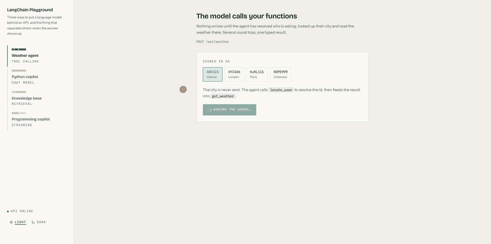
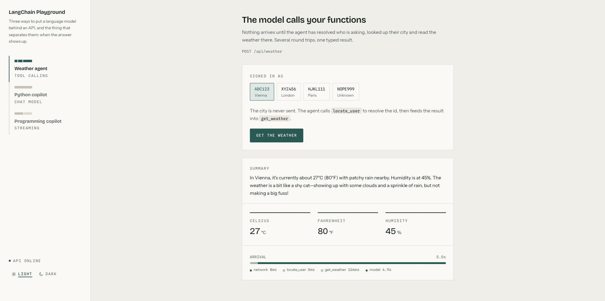
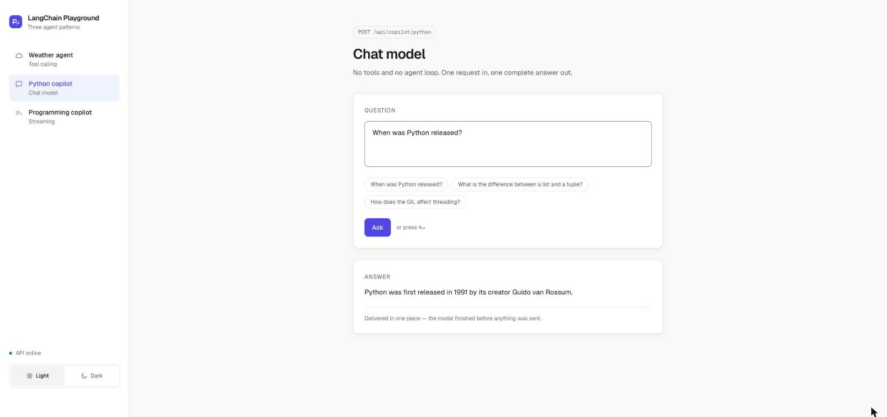
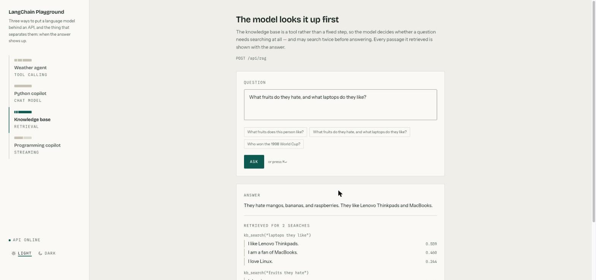
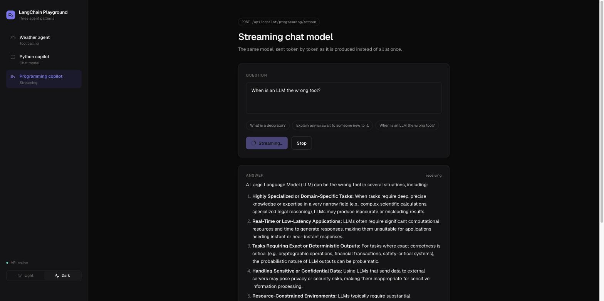
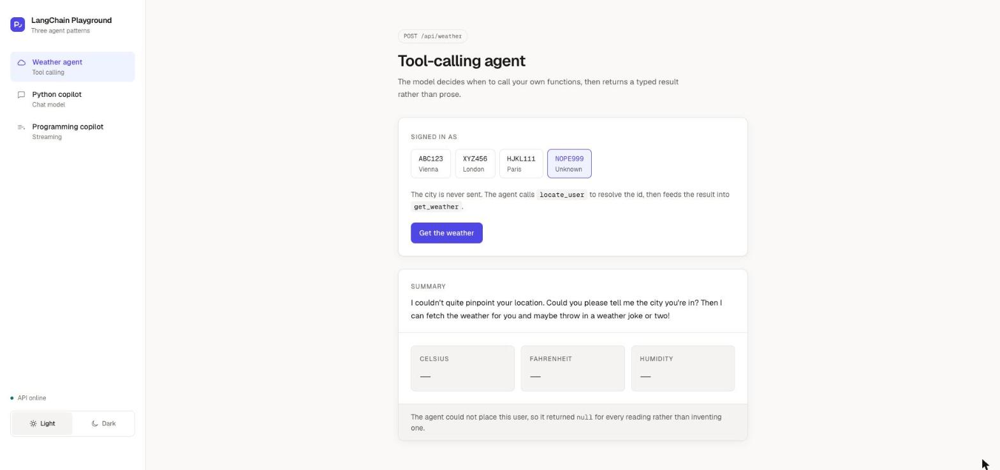

# LangChain Playground

[](https://github.com/olaheavy-dev/langchain-playground/actions/workflows/ci.yml)

A full-stack reference implementation of four distinct LLM integration patterns, built to
make the differences between them visible and comparable side by side.

**Stack:** FastAPI · LangChain · LangGraph · Python 3.13 · Next.js 16 · React 19 ·
TypeScript · Tailwind CSS v4 · pytest · Vitest



*Asking the tool-calling agent for the weather, then asking the knowledge base how the
project's own streaming endpoint works — with the arrival trace drawing itself as each step
completes.*

| Pattern | Module | Arrival | What it demonstrates |
| --- | --- | --- | --- |
| Tool-calling agent | `app/agents/weather.py` | several segments | The model decides when to call your own functions, and fills a typed response |
| Chat model | `app/agents/python_copilot.py` | one block | One request, one complete answer |
| Agentic retrieval | `app/agents/rag.py` | searches, then generation | The model decides whether to search the docs, and cites what it found |
| Streamed agent progress | `app/routers/progress_stream.py` | the rail drawing itself | Each step reported as it finishes, rather than a spinner until the end |
| Streaming chat model | `app/agents/streaming_copilot.py` | a filling rail | The same answer, sent token by token as it is produced |

The interface is built around that third column. Each pattern is labelled in the sidebar by
a miniature of its own **arrival trace**, and the full trace is drawn under every answer
from timings measured on the server. Same rail, three shapes — which is the difference the
whole project is about.

---

## The three patterns

### 1. Tool-calling agent

The caller sends only a user id. The agent calls `locate_user` to resolve that id to a
city, then feeds the result into `get_weather`, which hits a live weather API. The model
decides both calls and their order; nothing in the request names a city.

Output is a **typed structure**, not prose — the same Pydantic model serves as the HTTP
response schema and the agent's `response_format`.



The trace under the reading is the whole pattern in one line: `network 8ms`,
`locate_user 0ms`, `get_weather 166ms`, `model 4.9s`. Two tool calls that cost almost
nothing, and a model that costs everything — which is not the shape most people expect
before they measure it.

### 2. Chat model

No tools, no agent loop. A seeded system/human/AI exchange steers tone and depth, then one
`ainvoke` returns the complete answer.



One segment, because there is only one: nothing was visible until everything was.

### 3. Agentic retrieval

The knowledge base is a **tool**, not a fixed retrieve-then-generate step, so the model
decides whether a question needs searching at all — and may search more than once before
answering.

The corpus is **this project's own documentation**, so the demo explains itself: ask how the
streaming endpoint works and it answers from the file that says so, citing the section. The
markdown is chunked on headings — a chunk spanning two subjects retrieves well for neither —
and long sections split again on paragraphs, since an embedding of a thousand words is an
average of everything in them and matches nothing sharply. Embedded with
`text-embedding-3-large` into an in-memory vector store.



Every passage that came back is shown with its **similarity score and the section it came
from**, grouped under the search that found it, so a claim can be traced to the document
that made it rather than taken on trust.

The scores are worth reading. A question about the streaming endpoint pulls
`patterns.md — Streaming chat model` at `0.447` and `decisions.md — One schema, two jobs` at
`0.273` — the second a weak, tangential hit. Retrieval is fuzzy, and showing the scores is
what makes that visible rather than hidden behind a confident answer.

Ask something outside the knowledge base and the model declines, `sources` comes back
empty, and the interface says so plainly: an answer with nothing retrieved did not come
from the knowledge base.

### 4. Streaming chat model

The same model driven by `astream`. Tokens are pushed to the browser over server-sent
events and rendered as they arrive; the request can be cancelled mid-flight.



Caught mid-flight above — `STOP` is live, and gold is reserved throughout for work still in
flight. The answer scrolls inside its own panel rather than growing the page, and follows
the stream until you scroll away from the bottom.

Once it finishes, the trace splits into time-to-first-token and the long tail you spend
reading while the model is still writing — typically `464ms` then `3.1s`. That gap is why
streaming feels faster than a chat model which finishes sooner.

### Handling the failure case honestly

An unrecognised user id resolves to `Unknown`. Rather than let the model invent a
plausible `0.0`, the schema makes every reading nullable, so a failed lookup returns
`null` and the interface has to show it. That constraint propagates through the generated
TypeScript types, forcing the frontend to handle it too.



The trace corroborates it. There is no `get_weather` segment, because with no city there
was nothing to look up — the agent did not quietly fetch the weather somewhere else and
report that instead. Measuring each step is what makes a claim like that checkable rather
than a promise.

---

## Getting started

### With Docker

```bash
cp backend/.env.example backend/.env    # then add your OpenAI key
docker compose up --build
```

The interface is then on <http://localhost:3000> and the API on
<http://localhost:8000>.

### Without Docker

Requires Python 3.13+, [uv](https://docs.astral.sh/uv/), and Node 20+.

**Backend** — in one terminal:

```bash
cd backend
cp .env.example .env        # then add your OpenAI key
uv sync
uv run uvicorn app.main:app --reload
```

The API is then on <http://127.0.0.1:8000>, with interactive docs at
<http://127.0.0.1:8000/docs>.

**Frontend** — in another:

```bash
cd frontend
cp .env.example .env.local  # defaults to the backend above
npm install
npm run dev
```

The interface is then on <http://localhost:3000>. It needs the backend running;
the sidebar shows a live indicator either way.

## Deploying it

The backend ships a Dockerfile and a `fly.toml`; the frontend builds to a
standalone bundle that Vercel or any Node host will serve.

```bash
cd backend
fly launch --no-deploy
fly secrets set OPENAI_API_KEY=sk-... CORS_ORIGINS='["https://your-frontend.vercel.app"]'
fly deploy
```

Then point the frontend at it with `NEXT_PUBLIC_API_URL`. That value is inlined
into the client bundle at build time, so it is a build argument rather than a
runtime variable — changing it means rebuilding.

The knowledge base is embedded at startup rather than on first use, so a machine waking from
scale-to-zero pays the ~2.7s rather than the visitor who woke it. Set `WARM_KNOWLEDGE_BASE=0`
for a reload-driven dev loop, where it is otherwise paid on every restart for a corpus that
has not changed.

**Before putting it on the internet:** every `/api` route calls a paid model and
none of them asks who is calling. Set a spend cap on the key. The built-in rate
limiter (20 requests per minute per client, `RATE_LIMIT_PER_MINUTE`) caps a
caller's rate but not your monthly bill, and it counts in-process — with several
workers each gets its own allowance.

## Endpoints

### `POST /api/weather`

Reports the weather where the user is. The city is never sent by the caller — the agent
calls `locate_user` to resolve `user_id` to a city, then feeds that into `get_weather`.

```bash
curl -X POST http://127.0.0.1:8000/api/weather \
  -H 'Content-Type: application/json' \
  -d '{"user_id": "ABC123", "thread_id": "t1"}'
```

```json
{
  "summary": "In Vienna, it's currently 27°C (80°F) with patchy rain nearby. Humidity is at 45%...",
  "temperature_celsius": 27.0,
  "temperature_fahrenheit": 80.0,
  "humidity": 45.0,
  "trace": {
    "total_ms": 4041.7,
    "segments": [
      { "label": "model", "ms": 1301.4, "start_ms": 2.1 },
      { "label": "locate_user", "ms": 0.9, "start_ms": 1306.0 },
      { "label": "model", "ms": 694.2, "start_ms": 1309.8 },
      { "label": "get_weather", "ms": 167.3, "start_ms": 2007.5 },
      { "label": "model", "ms": 1400.6, "start_ms": 2180.2 }
    ]
  }
}
```

Known users are `ABC123` (Vienna), `XYZ456` (London) and `HJKL111` (Paris). Any other id
resolves to `Unknown`, and the agent says so rather than guessing — the three numeric
fields come back `null`, so callers must handle the case instead of reading a fabricated
`0.0`.

`trace` is measured, not estimated. Middleware wraps every model call and every tool call,
so each segment is timed where it happens and none is inferred by subtraction — which is
also why the agent shows *three* model calls rather than one: that is the loop it actually
ran.

Alongside the timings, the trace reports what the request consumed — model calls, input
and output tokens, and an estimated cost — because "how long did it take" and "what did it
cost" are the same question asked twice. The interface shows it under the rail:
`3 model calls · 909 in / 100 out · $0.0005`. An unpriced model reports the cost as
unknown rather than as zero, since those are different claims.

`total_ms` is wall time and is deliberately not the sum of the segments. Tool calls issued
in the same turn run concurrently, so segments can overlap; and the gaps between them are
the agent's own orchestration. The interface draws the segments against the total, so both
overlap and idle time are visible without inventing a position for time nobody measured.

`thread_id` identifies the conversation and `user_id` the person; they are deliberately
separate, so one user can hold several independent conversations.

### `POST /api/copilot/python`

```bash
curl -X POST http://127.0.0.1:8000/api/copilot/python \
  -H 'Content-Type: application/json' \
  -d '{"question": "When was Python released?"}'
```

```json
{ "answer": "Python was first released in 1991 by its creator Guido van Rossum." }
```

### `POST /api/weather/stream` and `POST /api/rag/stream`

The same work, reporting each step as it finishes rather than after the answer is ready.
An agent that calls two tools takes several seconds, and a spinner says nothing about which
of them is slow.

```
data: {"type": "step", "label": "model", "ms": 1023.4, "start_ms": 2.1}

data: {"type": "step", "label": "locate_user", "ms": 0.9, "start_ms": 1028.0}

data: {"type": "step", "label": "get_weather", "ms": 176.2, "start_ms": 2352.7}

data: {"type": "result", "reply": { ... }}
```

The interface draws the trace as those arrive, so the rail fills in while the agent works.

A failure travels as `{"type": "error"}` rather than a status code, because by the time it
happens the response has already begun and the status is long since sent.

**The agent is not cancelled when the client disconnects.** Stopping it between a tool call
being requested and its result being recorded leaves an unanswered tool call in the
checkpoint, and that state is replayed on every later request — so one closed tab would
break that thread permanently. Letting the run finish costs one answer nobody reads, which
is cheaper than a conversation that can never be used again.

### `POST /api/rag`

```bash
curl -X POST http://127.0.0.1:8000/api/rag \
  -H 'Content-Type: application/json' \
  -d '{"question": "What fruits do they hate, and what laptops do they like?", "thread_id": "t1"}'
```

```json
{
  "answer": "They hate mangos, bananas, and raspberries. They like Lenovo Thinkpads and MacBooks.",
  "sources": [
    { "text": "I despise mangos.", "score": 0.48, "query": "fruits they hate" },
    { "text": "I like Lenovo Thinkpads.", "score": 0.559, "query": "laptops they like" }
  ],
  "trace": {
    "total_ms": 4188.0,
    "segments": [
      { "label": "model", "ms": 2003.1, "start_ms": 1.9 },
      { "label": "kb_search", "ms": 578.4, "start_ms": 2010.2 },
      { "label": "kb_search", "ms": 610.7, "start_ms": 2010.9 },
      { "label": "model", "ms": 1000.3, "start_ms": 3180.0 }
    ]
  }
}
```

An empty `sources` list is not an error: the model is allowed to decide a question needs no
search, and the empty list is how a caller learns the answer did not come from the
knowledge base.

### `POST /api/copilot/programming/stream`

The same model, streamed as [server-sent events](https://developer.mozilla.org/en-US/docs/Web/API/Server-sent_events).

```bash
curl -N -X POST http://127.0.0.1:8000/api/copilot/programming/stream \
  -H 'Content-Type: application/json' \
  -d '{"question": "What is a decorator?"}'
```

```
data: {"token": "A"}

data: {"token": " decorator"}

data: [DONE]
```

Tokens are JSON-encoded because a token may contain a newline, and newlines are what
separate one SSE message from the next.

## Tests

111 tests, none of which call a model or the network. Both suites, plus lint, a typecheck
and a production build, run on every push and pull request
([`.github/workflows/ci.yml`](.github/workflows/ci.yml)) -- no API key needed, because
nothing in the suite reaches a model.

```bash
cd backend  && uv run pytest      # 50 tests
cd frontend && npm test           # 61 tests
```

**Backend** — `pytest` with `pytest-asyncio`, driving the app in-process through
`httpx.ASGITransport`, so no port is bound and no server needs to be running.

The model is stubbed at the router boundary. Calling it for real would cost money, need a
live key, and answer differently every run -- none of which tells you whether the wiring
is right. What is asserted instead is everything around it: that `user_id` and `thread_id`
arrive separately, that null readings survive serialisation as `null` rather than `0.0`,
that a token containing a newline still crosses the wire as one SSE event, and that the
stream always terminates with `[DONE]`.

The agent's own tools are tested for real. `locate_user` is called with a hand-built
`ToolRuntime`, and `get_weather` runs its actual httpx code against a `MockTransport` --
including the 503 case, where `raise_for_status` is what stops an error page being handed
to the model as though it were weather data.

**Frontend** — Vitest, jsdom and Testing Library, querying by role and visible text rather
than by class name, so a restyle does not break the suite.

The SSE reader gets the awkward cases: an event split across two network chunks, a token
containing newlines, a malformed payload that must be skipped rather than kill the stream,
and data arriving after `[DONE]`. The panels are tested through the interface -- clicking
`NOPE999` must produce three em dashes and no `0`, pressing Stop must actually abort the
signal, and unmounting mid-stream must not leave a request in flight.

## Evals

The test suite stubs the model everywhere, on purpose: tests have to be fast, free and
deterministic. That leaves a question nothing else answers — whether the agents actually
*behave*. Seven cases check that, against the real model:

```bash
cd backend && uv run python -m evals.run --repeats 3
```

```
case                                                      rate    attempts
--------------------------------------------------------  ------  --------
weather: known user gets a real reading                   ✓ 100%  3/3
weather: reading comes from the tool, not the model       ✓ 100%  3/3
weather: unknown user gets nulls, not a plausible number  ✓ 100%  3/3
rag: finds the fruit the person likes                     ✓ 100%  3/3
rag: distinguishes liked from hated                       ✓ 100%  3/3
rag: searches twice for a two-part question               ✓ 100%  3/3
rag: declines what the knowledge base cannot answer       ✓ 100%  3/3
--------------------------------------------------------  ------  --------
total                                                       100%  21/21

7 cases x 3 attempts in 10s, about $0.0064
```

Three things make this more than decoration.

**Each case runs several times.** Model output varies between identical calls, so one pass
could be luck and one failure could be noise. A rate is the honest summary; pass/fail is
not.

**The predicates check behaviour, not wording.** "Did it retrieve the passage about
bananas" survives a rephrase; "did it say exactly this" fails on output that is just as
correct, and a suite that cries wolf gets ignored.

**Two cases are regressions.** The agent was once observed reporting a temperature it never
fetched, and the knowledge base contains liked and hated fruit phrased almost identically —
which is exactly where naive similarity search goes wrong. Both are now checked on every
run.

The harness itself is unit-tested with fake cases, because a harness that has never been
seen to report a failure is not evidence of anything.

## Layout

```
backend/
├── pyproject.toml
├── app/
│   ├── main.py              # FastAPI app, CORS
│   ├── config.py            # settings, read from .env
│   ├── schemas.py           # request/response models
│   ├── agents/
│   │   ├── base.py          # shared chat model factory
│   │   ├── timing.py        # measures each step, for the arrival trace
│   │   ├── rag.py
│   │   ├── weather.py
│   │   ├── python_copilot.py
│   │   └── streaming_copilot.py
│   └── routers/
│       ├── weather.py
│       ├── rag.py
│       └── copilot.py
├── tests/                   # pytest, driven in-process over ASGI
└── evals/                   # behaviour checks against the real model

frontend/
├── app/
│   ├── layout.tsx           # fonts, theme applied before first paint
│   ├── page.tsx             # sidebar shell, one panel per pattern
│   └── globals.css          # design tokens, type and radius scales
├── components/
│   ├── Trace.tsx            # the arrival trace, and its miniature in the rail
│   ├── AnswerScroll.tsx     # capped, self-scrolling box for model output
│   └── …                    # panels, primitives, markdown renderer
├── lib/
│   ├── api.ts               # typed client, including the SSE reader
│   └── types.ts             # mirrors the backend schemas
└── vitest.config.mts        # tests live beside what they test, as *.test.tsx
```

`WeatherResponse` in `schemas.py` is both the agent's `response_format` and the base of
`WeatherReply`, the model the endpoint returns, so the API contract and the structure the
model must fill in are defined once. The trace lives on `WeatherReply` alone — it is the
server's account of its own work, and nothing the model should be asked to supply.

## Technical decisions

### One schema, two jobs

`WeatherResponse` is simultaneously the FastAPI `response_model` and the LangChain agent's
`response_format`. The structure the model is required to fill in and the contract the API
publishes cannot drift apart, because they are the same class. `lib/types.ts` mirrors it
on the frontend, so a nullable reading in Python is a `number | null` in TypeScript.

### Async all the way down

`ainvoke` and `astream` rather than their blocking counterparts, and `httpx.AsyncClient`
rather than `requests` inside the weather tool. A synchronous HTTP call in a tool blocks
the event loop for its full duration, so one slow upstream lookup would stall every other
in-flight request on the worker.

### Identity separated from conversation

`user_id` identifies the person; `thread_id` identifies the conversation. The original
script conflated them, which meant every user had exactly one eternal conversation and a
second caller could inherit the first one's context. Splitting them lets one user hold
several independent threads and keeps checkpointed state correctly partitioned.

### Streaming as a transport concern

The agent layer exposes an `AsyncIterator[str]`; the router decides it becomes SSE. Each
token is JSON-encoded before being written to the wire, because a raw token may contain a
newline and newlines are the SSE message delimiter — a subtlety that silently corrupts
naive implementations. The client reassembles the stream with a buffer that splits on the
blank-line delimiter and holds back any trailing partial message for the next chunk.

### Configuration and secrets

Settings are typed and validated at startup via pydantic-settings, so a missing key fails
immediately with a clear message rather than at first request.

The catch is that pydantic-settings reads `.env` into the settings object and stops there —
it never writes `os.environ`, which is the only place the OpenAI SDK looks. `load_dotenv()`
does the opposite, which is why the original scripts needed no key passed anywhere. So
every client here takes its key explicitly, and every client is built in `agents/base.py`
so that none can be constructed without one. That containment is the actual lesson: the
first version of the retrieval agent built its own embedding client, and the resulting
"Missing credentials" pointed at the key rather than at the plumbing.

### Designing for the subject rather than the template

The three patterns differ in exactly one thing — when their output arrives — so the
interface is built as a record of arrival rather than as a dashboard. Petrol ink on paper,
a gold reserved strictly for work happening right now, structure drawn with rules instead
of shadows, and a display face that is not the one every framework ships with.

The signature is the **arrival trace** under each answer: several segments for the agent
because it made several round trips, one solid block for the chat model because nothing was
visible until everything was, and a rail that fills live while tokens land. Same rail, three
shapes, which is the comparison the whole project exists to make.

Building it also caught a real bug. With per-tool timings on screen it became obvious that
the agent sometimes answered without calling `get_weather` at all — reporting a temperature
from the model's own head. The system prompt now forbids that, and the trace is where it
would show up again.

### Give the model what it needs, not what the API returned

`get_weather` returns current conditions rather than the upstream response. wttr.in's `j1`
format is around 26,000 characters — roughly 6,500 tokens of three-day hourly forecast —
and every one of them would go to the model as a tool message and then sit in the thread
for every later turn. The agent needs today's numbers, which is about 30 tokens' worth.

The cost of a tool result is easy to miss because nothing in the code looks expensive: it
is one `response.json()`.

### Paying for the vector store at startup

Built lazily, the first search embedded the whole corpus: 2.7s against 200ms for every
search after it — visible as a single fat `kb_search` segment in the trace, which is how it
was noticed. The work has to happen either way, but startup is a better place for it: a
health check gates traffic until it is done, so with scale-to-zero the machine waking pays
rather than the first visitor.

Deliberately not fatal. Three of the four endpoints never touch the vector store, so a bad
key or a network blip at startup would otherwise take the weather agent and both copilots
down with it. A failure is logged and the first search falls back to building it lazily.

### Timing as middleware

Each agent carries a `TracingMiddleware` that wraps model calls and tool calls, rather than
each tool timing itself. Two things follow. A tool no longer knows it is being measured, so
one added later is traced without anyone remembering to instrument it. And the model's
share stopped being a subtraction: it used to be "the total, minus the tools", which
quietly charged the agent's own orchestration to the model.

Measuring each call directly then exposed something subtraction had hidden — the agent runs
tool calls concurrently, so two searches issued together overlap in real time. Adding their
durations both invented an order and overstated retrieval, which is why segments carry a
start offset and the trace is drawn as a timeline rather than a stacked bar.

### Retrieval as a tool, and a failing tool that answers

The knowledge base is a tool the model may call rather than a step that always runs, which
is what makes the interesting cases observable: a question answered without searching, and
a question that needed two searches. Both are visible in the interface rather than inferred.

`kb_search` returns its failure to the model instead of raising. A tool that raises never
produces a tool message, so the checkpoint keeps an assistant turn with an unanswered tool
call — and because that state is replayed on the next request, the thread stays broken for
good. Found the hard way, when a missing numpy turned one failed search into an endpoint
that returned 500 for every later question on that thread.

`InMemoryVectorStore` rather than FAISS: for ten short strings an index buys nothing, and
it avoids depending on `langchain-community`, which is being sunset. The interface is the
same, so a real store is a one-line swap.

### Theming without variant sprawl

Frontend colours are semantic CSS variables (`--surface`, `--text-muted`) rather than
Tailwind `dark:` variants, so a theme change swaps values in one place instead of touching
every component. The stored choice is applied by an inline script before first paint, so
the page never renders in the wrong theme and corrects itself. `ThemeToggle` reads
`<html data-theme>` through `useSyncExternalStore` rather than mirroring it into React
state, keeping a single source of truth.

## Known limitations

Deliberate scope boundaries rather than oversights:

- **`InMemorySaver` for conversation state.** Process-local: history is lost on restart and
  is not shared across workers. Production would use a database-backed checkpointer; the
  interface is identical, so it is a one-line swap.
- **Weather threads grow without bound.** A user's thread is reused across requests, so its
  history only ever gets longer. It grows slowly now — the tool returns current conditions
  rather than the full wttr.in response, which is ~26,000 characters of three-day forecast
  and was being sent to the model and then carried in the thread for every later turn. If
  this panel ever became a real conversation, that is where `SummarizationMiddleware` or
  message trimming would earn its place; today nothing in the interface depends on the
  agent remembering, so neither is pulling its weight.
- **Rate limiting is in-process.** Counters live in the middleware instance, so N
  workers means N times the allowance, and a restart forgets everyone. Enough to stop a
  runaway loop on a demo; a real deployment would keep the counters in Redis.
- **No authentication.** `user_id` arrives in the request body. Real deployment would take
  it from a verified session, not from the client.
- **No end-to-end test.** The suite covers each side of the boundary but never runs the
  two together against a live model, so a schema change that breaks the contract would
  pass both halves. A Playwright run against a recorded backend would close that gap.
